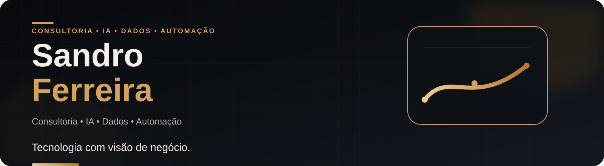

  

  <a href="https://sandrozdb.com"><strong>Portfólio</strong></a> •
  <a href="https://linkedin.com/in/sandrozdb"><strong>LinkedIn</strong></a> •
  <a href="mailto:sandrozdb@gmail.com"><strong>E-mail</strong></a>

## Sobre mim

Sou **Estagiário de Consultoria na Elo** e estudante de **Engenharia da Computação** e de **Inteligência Artificial e Automação Digital**, com foco em aplicar **IA, dados e automação** na resolução de problemas reais de negócio.

Na consultoria, atuo apoiando a **estruturação de problemas, análise de informações, identificação de casos de uso de IA, experimentação com prompts e agentes de IA e construção de materiais executivos**.

Minha trajetória combina tecnologia, análise de dados, infraestrutura, liderança e comunicação. Também construí uma marca digital com mais de **100 mil seguidores**, utilizando métricas de alcance, engajamento e retenção para orientar decisões de conteúdo e crescimento.

Minha formação como **Aspirante a Oficial da Arma de Comunicações do Exército Brasileiro** fortaleceu competências como liderança, disciplina, comunicação, trabalho em equipe e tomada de decisão.

## Foco profissional

**Consultoria • Inteligência Artificial • Dados • Automação**

Busco conectar visão de negócio e capacidade técnica para **estruturar problemas, melhorar processos, apoiar decisões e gerar valor com tecnologia**.

## Projetos em destaque

| Projeto | Problema e solução | Tecnologias |
|---|---|---|
| **[LifeBox — Transporte Inteligente de Órgãos](https://github.com/sandrozdb/lifebox-smart-organ-transport)** | Sistema acadêmico de monitoramento, rastreabilidade e apoio à decisão no transporte de órgãos, com IoT, telemetria, alertas e otimização de rotas. | Node.js, Express, MySQL, IoT, Pesquisa Operacional |
| **[CorpAI — Assistente Corporativo Inteligente](https://github.com/sandrozdb/corpai-assistente-corporativo-ia)** | Assistente corporativo com IA generativa para classificar, redigir e revisar comunicações, com Human in the Loop em cenários de maior risco. | n8n, Gemini, IA Generativa, Prompt Engineering, Human in the Loop |
| **[EasyFood — API de Restaurantes](https://github.com/sandrozdb/easyfood-api)** | Aplicação para consulta e cadastro de restaurantes, com arquitetura modular, validação, persistência em MySQL e decisões documentadas em ADRs. | Node.js, Express, Prisma ORM, MySQL |
| **[Recommendation Lab — Simulador de Recomendações](https://github.com/sandrozdb/recommendation-algorithm-simulator)** | Simulador interativo que mostra como sinais comportamentais alteram perfil inferido, scores e ranking de recomendações. | JavaScript, HTML, CSS, Node.js, GitHub Actions |
| **[Automação de Triagem de Notas Fiscais](https://github.com/sandrozdb/automacao-triagem-notas-fiscais-n8n-ocr)** | Pipeline demonstrativo para recebimento, leitura, validação e direcionamento de documentos fiscais. | n8n, OCR, Python, SQL |
| **[Vitrine de Carreira](https://github.com/sandrozdb/vitrine-de-carreira)** | Plataforma de diagnóstico e posicionamento profissional que transforma informações de carreira em recomendações práticas. | HTML, CSS, JavaScript, UX |

  <a href="https://sandrozdb.com"><strong>Ver portfólio completo →</strong></a>

## Competências

| Área | Competências e tecnologias |
|---|---|
| **Consultoria & Negócios** | Estruturação de problemas, análise de informações, storytelling, PowerPoint, Pesquisa Operacional, comunicação |
| **Dados & Analytics** | Excel, Power BI, SQL, Python, Pandas, visualização de dados |
| **IA & Automação** | IA Generativa, LLMs, Agentes de IA, Prompt Engineering, Microsoft Copilot, n8n, OCR, APIs |
| **Tecnologia & Desenvolvimento** | Node.js, Express, Prisma ORM, JavaScript, MySQL, Git, GitHub |
| **Cloud, Infra & IoT** | OCI, Linux, redes TCP/IP, ESP32, ThingSpeak, virtualização, segurança da informação |

## Formação

- **Engenharia da Computação — UniFECAF** · 2025–2028
- **Inteligência Artificial e Automação Digital — UniFECAF** · 2026–2027
- **Engenharia de Controle e Automação — IFSP** · 2022–2024
- **CPOR/SP — Aspirante a Oficial da Arma de Comunicações** · 2023

## Certificações selecionadas

- Oracle OCI 2026 AI Foundations Associate
- Cisco Data Science Essentials with Python
- Cisco Data Analytics Essentials
- Cisco Introduction to Modern AI
- Python Essentials 1 e 2
- Linux Essentials
- Ethical Hacker
- CCNAv7 Introduction to Networks
- IBSEC Cyber Security Awareness

## Vamos conversar?

Tenho interesse em projetos e oportunidades que conectem **consultoria, inteligência artificial, dados e automação** a problemas reais de negócio.

  <a href="https://linkedin.com/in/sandrozdb">LinkedIn</a> •
  <a href="https://sandrozdb.com">Portfólio</a> •
  <a href="mailto:sandrozdb@gmail.com">E-mail</a>

